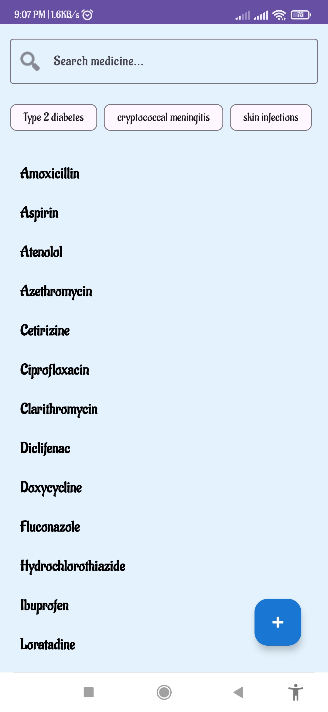
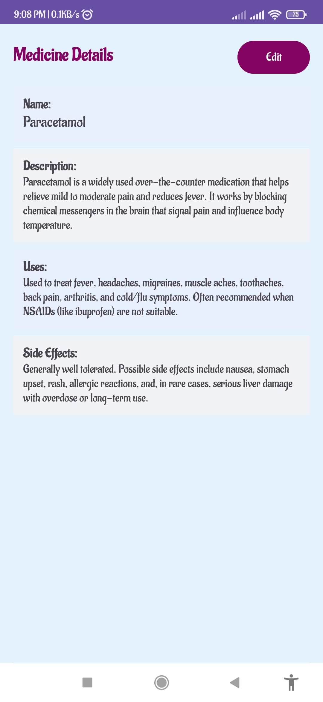
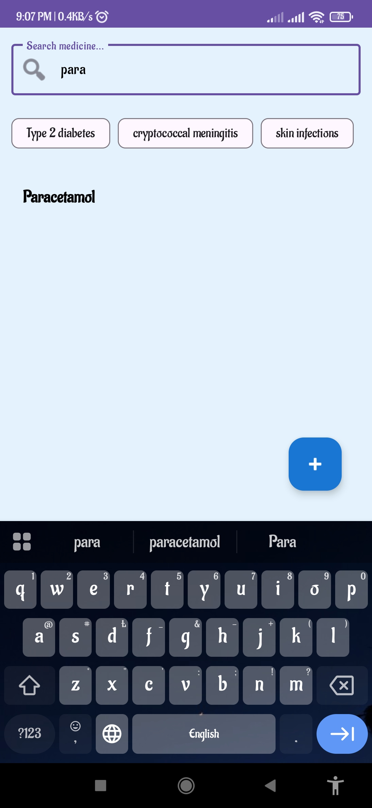
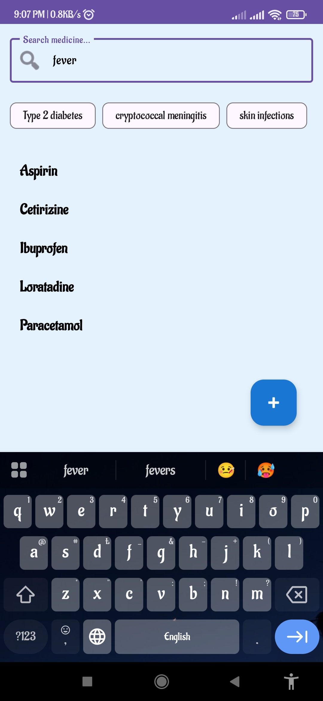
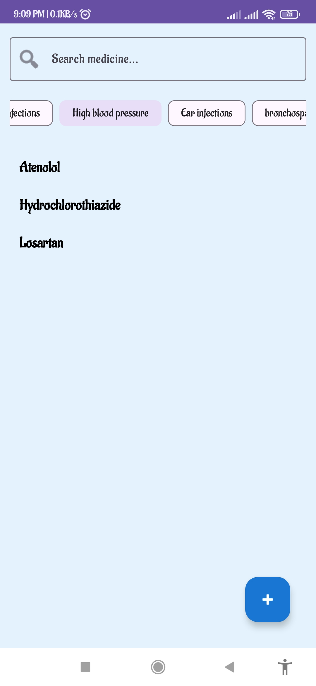
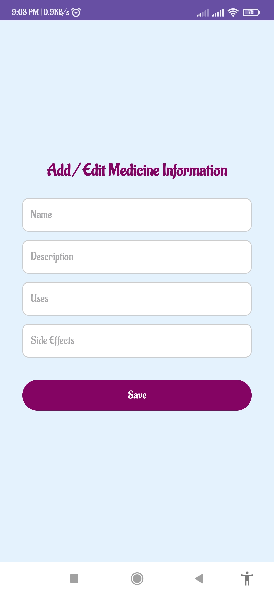
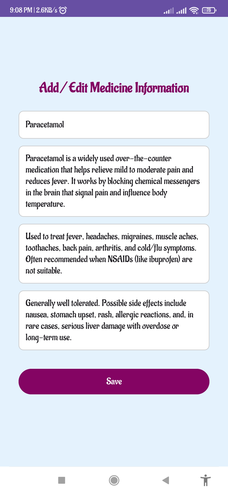

# 💊 MedicineInfo – Android App

A simple and clean Android application that helps users find detailed information about medicines — including description, uses, and side effects.

## 🚀 Features
- Search medicines by name
- View medicine details (uses, side effects, etc.)
- Display results in alphabetical order
- Firebase integration for data storage
- User-friendly interface

## 🧰 Tech Stack
**Java**, **XML**, **Firebase**, **Android Studio**

## 📱 Screenshots
| Splash | Medicine List | Medicine Details | Search by Medicine |
|------|--------|----------|-------|
|  |  |  |  |

| Search by Disease | Filter by Category | Add Medicine | Edit Medicine |
|--------|------|------|------|
|  |  |  |  |

## 🔗 Links
- 🌐 [Portfolio Project Page](https://iamcrk.me/#medicineinfo)
- 📦 [Download APK](https://drive.google.com/file/d/1yRlc9uvmJddToroFQoUxPw5gEY2tPoS0/view?usp=drive_link)
